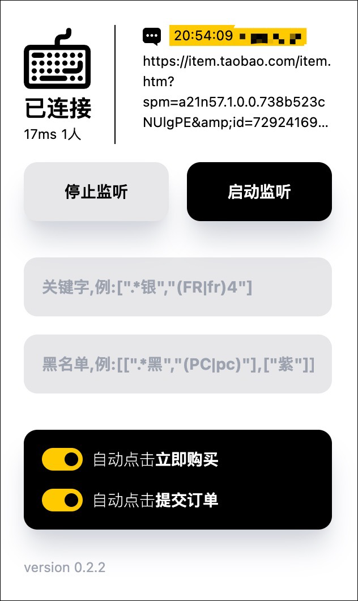

<div align="center">
  <h2 style="text-align: center;">淘宝随机链接抢单插件</h2>



<p></p>
<sup>战利品</sup>


`Space65R3阳极银 x4` `胶囊65阳极银 x2` `BD60阳极银HHKB x2` `PurePlayer键帽 x4` `Wins钛合金航插线 x2` `Manda电镀镜面 x1`

</div>

视频演示

https://github.com/boring-keyboard/bot/assets/160836323/8a36f8d4-4539-41b3-80ef-ca2c98c38905


# 安装

- **第1步** 插件zip包下载地址 https://github.com/boring-keyboard/bot/releases
- **第2步** 下载后解压到本地磁盘
- **第3步** 打开chrome浏览器扩展管理页面 chrome://extensions
- **第4步** 打开开发者模式并加载插件目录
- **第5步** 加载成功后页面会出现此插件


- **第6步** 打开插件启用开关

# 使用

## 1 自动选择规格并提单

- **第1步** 随便打开一个taobao商品详情页（不能是天猫商品）
- **第2步** 点击chrome浏览器右上角的扩展程序图标，点击插件图标 
- **第3步** 在弹出的页面中输入关键字，关键字规则为JSON数组格式，每个元素作为一个关键字，使用Javascript正则表达式匹配
- **第4步** 点击随机链接，插件会自动选取与关键字相匹配的商品规格

## 2 自动监听QQ群随机链接

自动监听QQ群收到的商品链接并跳转

点击 **启动监听** 后，此页面开始监听QQ群消息发出的taobao商品链接并做自动跳转（建议群禁言后再开启）

### 2.1 启动前准备

- 安装nodejs v20.x.x

### 2.2 启动服务

- **第1步** 打开终端
- **第2步** 进入插件`server`目录
- **第3步** 创建并编辑`groups.txt`文件，添加需要监听的QQ群号，多个群通过换行分割。例如：
```
  123456
  456789
```
- **第4步** 安装依赖，在终端中执行  
```
  npm install
```
- **第5步** 启动服务，在终端中执行
```
  node ./run.js
```
- **第6步** 按提示扫码登录QQ

## 3 关键字设置说明

关键字用于匹配商品规格，请注意以下几个约定

  - 关键字使用javascript正则表达式匹配，不区分大小写
  - 越靠前的关键字优先级越高
  - 当某个规格选项无法匹配到任何关键字时，则随机选择一个
  - 当某个规格选项已经售罄，即使匹配了关键字也会随机选择一个未售罄的

举例说明

  - 想抢购银色、hhkb配列、fr4定位板
```javascript
  ["银","silver","hhkb","fr4"]
```

  - 颜色优先银色，其次米白（复古白），配列优先hhkb，其次wkl
```javascript
  ["银","silver","(米|复古)白","cream","hhkb","wkl"]
```
